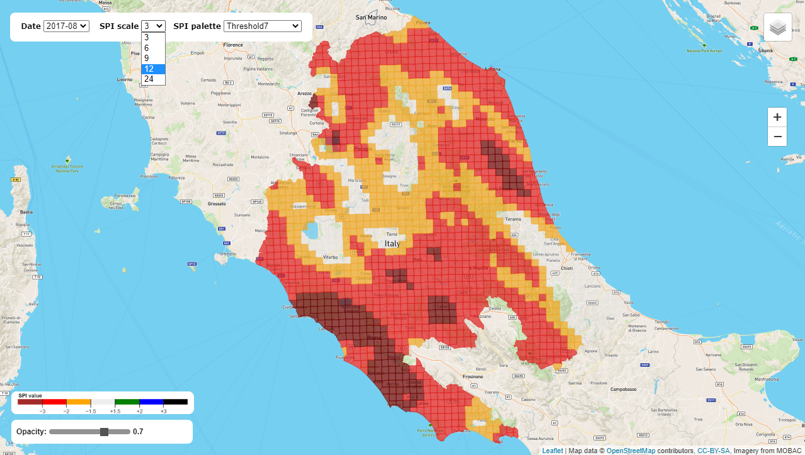

# drought-bulletin
This web application is developed with the scope to create an interactive drought-bulletin, without the use of GIS software.
The application show a map where Standard Precipitation Index (SPI) values are drawn over it. Values are shown in clickable color cells. Clicking on a cell open a pop-up with the value, you can change the colors of the cells using the color palette. On the layer menu is possible select the pluviometric stations layer that show clickable orange icons on the map. When you click on a icon station you get a pop-up with the name of the station and you can explore it, clicking on Explore. When you click on Explore a Window appear over the map showing a graph. You can see in this graph the data for a single month in each available year or show daily data for a specific data range.

<i>Home Page<i>

<i>Graph of the selected month in each year</i>

<i>Graph of the selected data range</i>

<i>Pluviometric stations on the map while selecting active layer</i>

<i>Different color palette while selecting new SPI scale</i>

## Directory structure
### App
Contains the app
### Data
Contains data, image and scripts used in the development of the app
### Exercises
Contains tests and exercises

## Licence
BSD 3-Clause "New" or "Revised" License
A permissive license similar to the BSD 2-Clause License, but with a 3rd clause that prohibits others from using the name of the project or its contributors to promote derived products without written consent.
